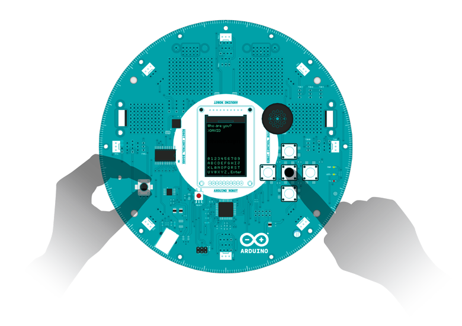
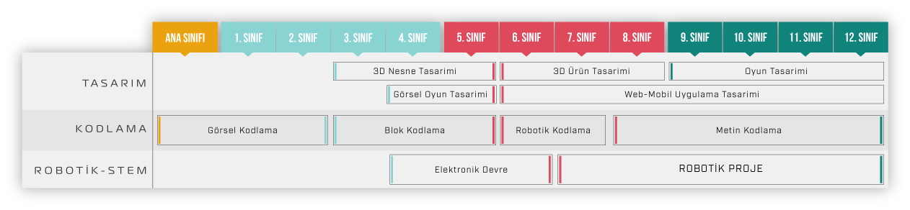

<h1 align="center">8-14 Yaş Grubundaki Çocuklar İçin Kodlama </h1>
<h1 align="center">SCRATCH ve mBLOCK </h1>

## Giriş

Pandemi döneminden önce lise yaş grubundaki öğrencilerle yaptığım arduino ile ilgili eğitim çalışmaları paylaşılmıştır. 

Özellikle lise seviyesine uygun müfredat belirlenmiş ve buna uygun  birçok yabancı ve yerli kaynak taranmış ve elde edilen tecrübelerle de birleştirilerek ders içerikleri hazırlanmıştır.

Yararlanılan müfredatlar açık kaynak olup ingilizceden çeviri yapılmış ve yaş gruplarına uygun olacak şekilde tekrar düzenlenerek slaytlar ile desteklenmiştir. 

Resim: Yaşlara göre STEM çalışmaları.

Lise çağındaki öğrencilerin matematik-fizik becerileri de düşünülerek yapılan uygulamalar ona göre düzenlenmiştir. 
  
Gelecekte kendisine yazılım alanını seçmek isteyen öğrencilere yazılım ve donanımla tanışmak için güzel bir başlangıç olacağını düşünüyorum.

Umarım ilgilenenlere faydalı olur...

## İletişim

- GitHub [@your-ilyas9461](https://github.com/ilyas9461)
- Linkedin [@your-linkedin](https://www.linkedin.com/in/ilyas-yagcioglu/)
